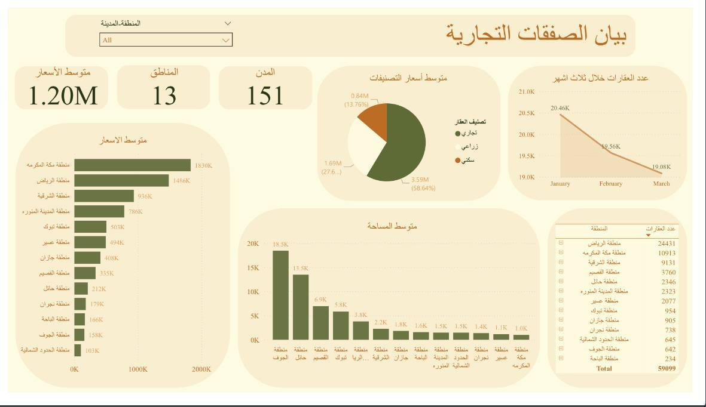

# 🏡 داشبورد بيانات العقارات

هذا المشروع عبارة عن داشبورد في Power BI لتحليل مبيعات العقارات ومتوسط الأسعار حسب نوع العقار والموقع.  
تم تصميمها لاستخراج رؤى تساعد في فهم السوق العقاري واتخاذ قرارات مدروسة.

---
## 🛠 الأدوات المستخدمة
- Power BI  
- Excel (مصدر البيانات)  
- DAX
---

## 🎯 الأهداف
- تحديد أكثر أنواع العقارات ربحية  
- مقارنة متوسط الأسعار حسب المدينة ونوع العقار  
- عرض تطور المبيعات عبر الوقت
---

## 📊 نظرة عامة
- متوسط الأسعار : 1.20M
- عدد المدن : 151
- عدد المناطق : 13
- تصنيف العقارات : 3 أنواع

 ---

## 🏆 أهم النتائج
- أعلى متوسط للأسعار : منطقة مكة المكرمة
- أعلى متوسط المساحة : منطقة الجوف
- أكثر منطقة امتلاكا للعقار : منطقة الرياض
- في خلال ثلاث أشهر من شهر يناير الى شهر مارس يحتل(شهر يناير 1) أكثر الاشهر شراء للعقار
--- 

## 📸 صورة من الداشبورد 
  

---
## 📂 الملفات في المشروع
- (ملف الاصلي/ Power BI) https://github.com/Muna5abdullah/Real-Estate-Dashboard/blob/main/Real%20estate%20dashboard%20.pbix 
- (نسخة داشبورد )  https://github.com/Muna5abdullah/Real-Estate-Dashboard/blob/main/Real%20estate%20dashboard.pdf 
